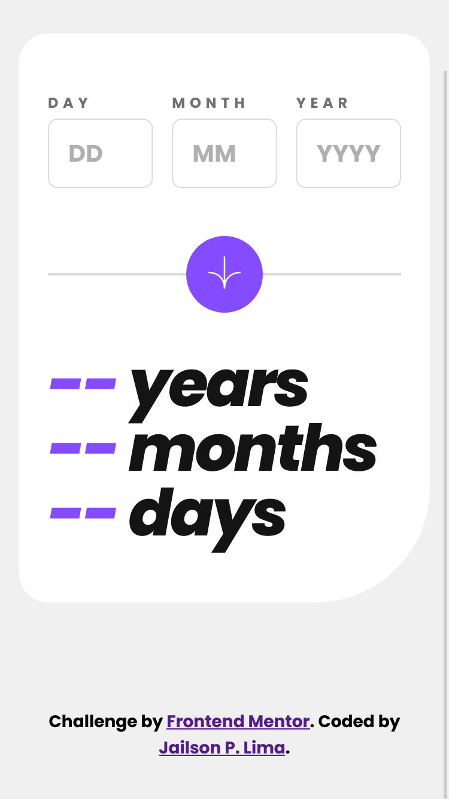
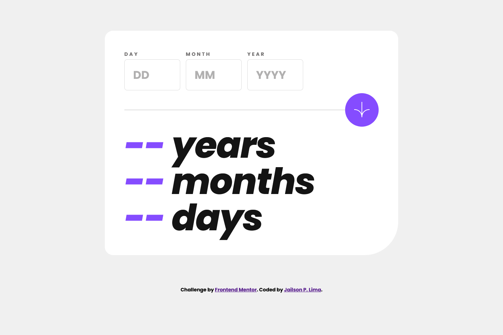

# Age Calculator App

Esta é uma solução para o desafio [Age calculator app no Frontend Mentor](https://www.frontendmentor.io/challenges/age-calculator-app-dF9DFFpj-Q). Os desafios do Frontend Mentor ajudam a melhorar suas habilidades com projetos realistas.

## Tabela de conteúdos

- [Visão geral](#Visão-geral)
  - [Desafio](#Desafio)
  - [Capturas de tela](#Capturas-de-tela)
  - [Links](#Links)
  - [Tecnologias](#Tecnologias)
- [Autor](#Autor)

## Visão-geral

### Desafio

Os usuários devem ser capazes de:

- Visualizar a idade em anos, meses e dias após enviar uma data válida por meio do formulário
- Receber erros de validação se:
  - Qualquer campo estiver vazio quando o formulário for enviado
  - O número do dia não estiver entre 1-31
  - O número do mês não estiver entre 1-12
  - O ano estiver no futuro
  - A data for inválida, por ex. 31/04/1991 (abril tem 30 dias)
- Ver o layout ideal para a interface, dependendo do tamanho da tela do dispositivo
- Ver os estados de `:hover` e `:focus` para todos os elementos interativos na página

### Capturas-de-tela

### Links

### Tecnologias

- HTML5 Semântico
- Propriedades personalizadas CSS3
- JavaScript ES6
- Fluxo de trabalho Mobile-first

## Autor

- Frontend Mentor - [@JailsonPLima](https://www.frontendmentor.io/profile/JailsonPLima)
- LinkedIn - [@JailsonPLima](https://www.linkedin.com/in/jailsonplima/)
